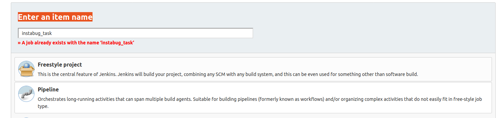
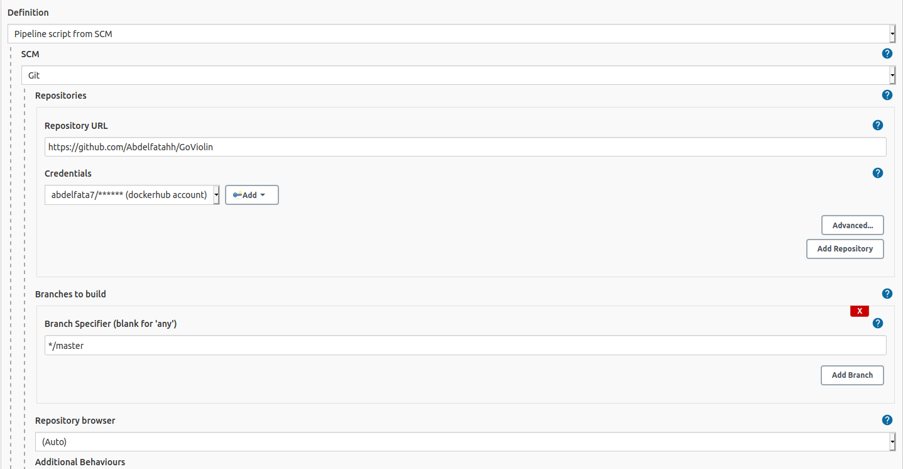
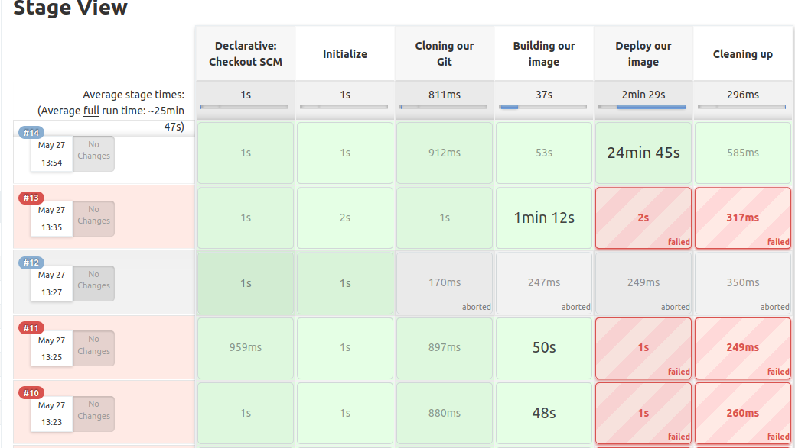
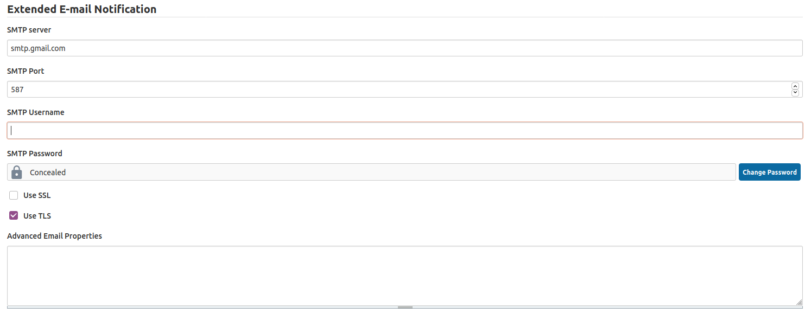

# GoViolin

GoViolin is a web app written in Go that helps with violin practice.

Currently hosted on Heroku at https://go-violin.herokuapp.com/

GoViolin allows practice over both 1 and 2 octaves.

# Go installation

If you are new to go I suggest that you check the installation guide, due to my experience:

- You need to install go from [GO Docs](https://golang.org/doc/install).
- Then Clone this project using the command `git clone https://github.com/Abdelfatahh/GoViolin`
- Now all you need is to build and run the project.
- To build the project use `go mod init`
- The result will be **\*go: creating new go.mod: module github.com/Rosalita/GoViolin
  go: copying requirements from vendor/vendor.json
  go: to add module requirements and sums:
  go mod tidy**
- `go build -o goviolin.o .`

That was the very first step to see the application running on your local machine.

# Docker Installation

- To run docker on your machine you first need to install it :

```bash
sudo apt-get update
```

```bash
sudo apt-key adv --keyserver hkp://p80.pool.sks-keyservers.net:80 --recv-keys 58118E89F3A912897C070ADBF76221572C52609D
```

```bash
sudo apt-add-repository 'deb https://apt.dockerproject.org/repo ubuntu-xenial main'
```

```bash
sudo apt-get update
```

```bash
sudo apt-get install -y docker-engine
```

```bash
sudo systemctl enable docker
```

# Jenkins Installation

There are different ways to install jenkins but lets go through this one..

```bash
sudo mkdir -p /var/jenkins_home
```

```bash
sudo chown -R 1000:1000 /var/jenkins_home/
```

```bash
docker run -p 8080:8080 -p 50000:50000 -v /var/jenkins_home:/var/jenkins_home --name jenkins -d jenkins/jenkins:lts
```

Head to https://localhost:8080/

```bash
cat /var/jenkins_home/secrets/initialAdminPassword
```

A screen with “Create First admin User prompt” will appear. You will need to enter a username, password, full name and email address.

# Jenkins Plugins

- Once you are in the jenkins homepage create a freestyle project.
- Then go to manage jenkins then manage plugins and install `CloudBees Docker Build and Publish plugin` and `Go plugin`

#

Now Head to your go project and create the Dockerfile using the command

```bash
nano Dockerfile
```

and add the following code to it.

```docker
FROM golang:1.16 AS builder
WORKDIR /go/src/app
COPY . .
RUN export CGO_ENABLED=0 && go mod init && go build -o main .

FROM alpine:latest
WORKDIR /app
COPY --from=builder /go/src/app .
EXPOSE 8080
CMD ["./main"]
```

then build the docker image using the command

```bash
docker build -t goviolin .
```

then run the image on your localhost to see it running

```bash
docker run --publish 8999:8080 goviolin:latest
```

#

Now we need to push the image to [Dockerhub](https://hub.docker.com). To push the image to dockerhub first we need to login to docker using our terminal using the command:

```bash
docker login
```

- You'll enter your username and password and now you are loggedin!

- Now you are ready to send your image to Dockerhub!

- List your docker images

```bash
docker images
```

- Run our docker image in the background.

```bash
docker run -d -p 8999:8080 goviolin:latest
```

- List the running containers using

```bash
docker ps
```

- Get the container id of our image and commit it to your docker hub

```bash
docker commit CONTAINER_ID <your-username>/<your-repo-name>:[tagname]
```

- In our case it will be like this

```bash
docker commit 7ab94666de1a abdelfata7/go-violin-instabug:instabug
```

- Then we push it to the repo.

```bash
docker push abdelfata7/go-violin-instabug:instabug
```

- The result will be something like this

```bash
The push refers to repository [docker.io/abdelfata7/go-violin-instabug]
1bcbf7c4977d: Pushed
3dca23a82013: Pushed
b2d5eeeaba3a: Mounted from library/alpine
instabug: digest: sha256:4c3ba7fbb24124753367c970ff7193f15f9894c80b22474f0f40a18c6a3dd826 size: 948
```

- The link to our image is [here](https://hub.docker.com/layers/151394918/abdelfata7/go-violin-instabug/instabug/images/sha256-4c3ba7fbb24124753367c970ff7193f15f9894c80b22474f0f40a18c6a3dd826?context=explore).

#

# Jenkins Pipeline

Go to http://localhost:8080 and login to your jenkins account.

- Create a new job
  

- Then go to configure

- Scroll down to Pipeline and select the Pipeline script from SCM and select GIT

- Add your repo URL
  

- Install Docker Plugin and add your docker credentials to your jenkins environment.

- Build your pipeline by clicking build now in the main page of the job.

- I suffered in the configuration so I got my build failed multiple times but at the end it worked successfully.
  

#

# Reporting using Email Extension Plugin

- To get reported after each build with the status of the pipeline you need to configure a mail server first.
- In my case I used my personal one on my gmail.
- Go to Manage Jenkins
- Configure System
- You'll find Extended Email Notification.
- Fill it with your credentials.
- It will be something like this
  
